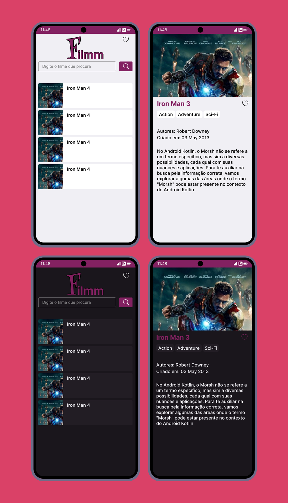

# Filmm App 🎥

### Status: Em desenvolvimento

<p> 🎬 Filmm App é um aplicativo android onde é possivel procura por filmes, ver detalhes do filme e salvar filmes favoritos no dispositivo.</p>

<p align="center">
    
</p>

## Funcionalidades:
- Buscar por filmes
- Ver detalhes do filme
- Salvar no dispositivo os filmes favoritos

## O foi utilizado:
- Kotlin com JetPack Compose
- Courontimes
- Retrofit
- Room
- Coil
- Arquitetura MVVM

## Download do App
Acesse (link futuro)

## Como usar

### Requisitos:
- Ter o sdk e jdk instalado na maquina.

### Baixando:
```shell
git clone https://github.com/Faguim02/Filmm-App.git

cd filmm_app
```

### baixe todas as dependencias do arquivo gradle

### pronto para uso

## Caso queira contribuir, pode ficar a vontade. Obrigado!